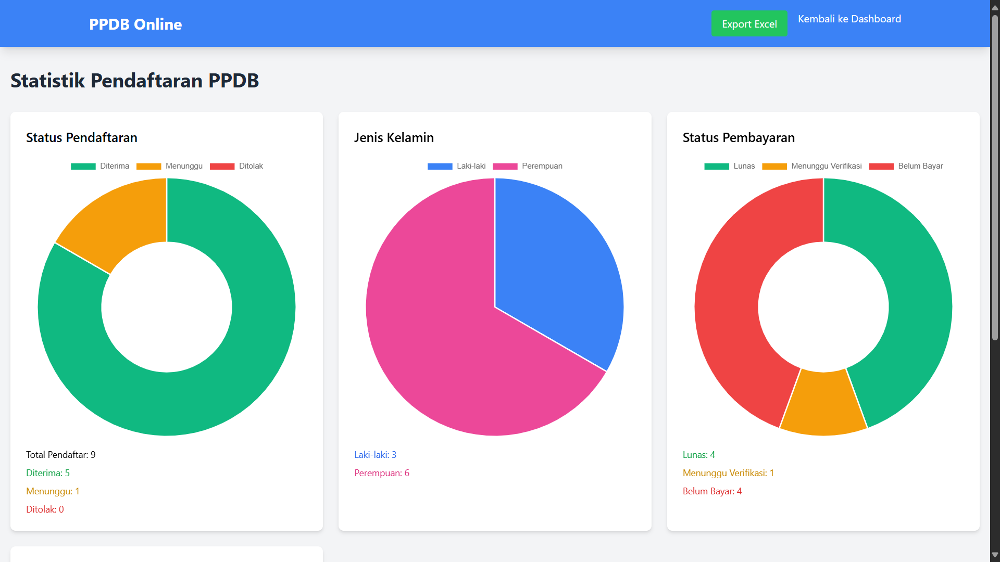

# PPDB Online System

Sistem Penerimaan Peserta Didik Baru (PPDB) Online berbasis web menggunakan Flask dan Tailwind CSS.

## Features

### User Features
- Registration and Login System
- Student Registration Form
- Document Upload
- Payment Processing & Status Tracking
- Payment Proof Upload
- Email Notifications
- Dashboard Status Monitoring

### Admin Features
- Complete Admin Dashboard
- Application Management
- Payment Verification
- User Management
- Email Management
- Statistics & Reports
- Form Review & Approval

## Screenshots

### User Interface
| Page | Description |
|------|-------------|
||Login Page|
||Registration Page|
||User Dashboard|
||Student Registration Form|
||Payment Process|
||Payment Completed|

### Admin Interface
| Page | Description |
|------|-------------|
||Admin Dashboard|
||Statistics Page|
||Payment Verification|
||Email Management|

## Technical Stack

- **Backend:** Python Flask
- **Database:** SQLite with SQLAlchemy
- **Frontend:** HTML5, Tailwind CSS
- **Email Service:** Flask-Mail dengan Gmail SMTP
- **Authentication:** Flask-Login
- **File Upload:** Werkzeug
- **Database Migration:** Flask-Migrate

## Requirements

- Python 3.x
- Required Python packages:
  ```
  Flask==2.0.1
  Flask-SQLAlchemy==2.5.1
  Flask-Login==0.5.0
  Flask-Mail==0.9.1
  Flask-Migrate==3.1.0
  Werkzeug==2.0.1
  ```

## Installation

1. Clone repository:
```bash
git clone https://github.com/yourusername/ppdb-online.git
cd ppdb-online
```

2. Setup virtual environment:
```bash
python -m venv venv
venv\Scripts\activate
```

3. Install dependencies:
```bash
pip install -r requirements.txt
```

4. Configure email settings in `__init__.py`:
```python
MAIL_SERVER = 'smtp.gmail.com'
MAIL_PORT = 587
MAIL_USE_TLS = True
MAIL_USERNAME = 'your-email@gmail.com'
MAIL_PASSWORD = 'your-app-password'
```

5. Initialize database:
```bash
flask db init
flask db migrate
flask db upgrade
```

6. Run application:
```bash
python run.py
```

## Configuration

Update configuration in `__init__.py`:
- Database settings
- Email configuration
- Upload folder paths
- Secret key
- Maximum file size

## Features Detail

### User Module
- Account registration and login
- Complete student registration form
- Document upload system
- Payment processing
- Status tracking
- Email notifications
- Dashboard monitoring

### Admin Module
- Complete admin dashboard
- Application review system
- Payment verification
- User management
- Email system
- Statistical reports
- Form management

## Security Features

- Password hashing
- CSRF protection 
- Secure file upload
- Role-based access control
- Session management
- Secure email configuration

## Database Schema

- Users
- StudentForms
- PaymentSPP
- AcceptedStudents
- RejectedStudents
- Notifications

## Support

For technical support:
- Email: your-email@domain.com
- Documentation: /docs
- Issue Tracker: GitHub Issues

## License

This project is licensed under the MIT License

